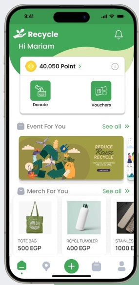
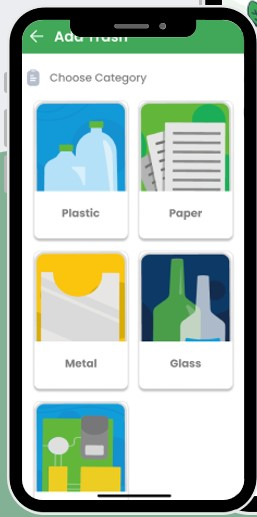
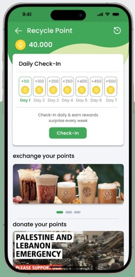
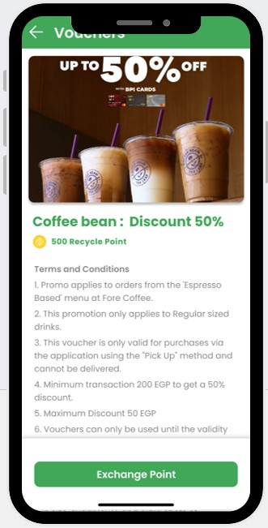

# Recycle Page 🌱

## Overview
The Recycle Page is a Flutter-based application designed to encourage recycling and sustainability. It provides users with features to recycle efficiently, stay informed, and contribute to environmental causes. This is a frontend-only application, showcasing the potential of a complete recycling ecosystem.

---

## Features
- **Donate Using Points**: Earn points for recycling and donate them to causes that matter.
- **Use Vouchers**: Redeem points for vouchers and exciting rewards.
- **Read Articles**: Access a library of articles about sustainability, recycling tips, and environmental awareness.
- **Events**: Stay updated on local recycling and environmental events.
- **Recycle All Types of Trash**: Accepts various types of waste for recycling.
- **Drop-Off or Pick-Up Options**: Choose between dropping off trash or scheduling a convenient pickup.

---

## Screenshots
Below are some screenshots showcasing the app's interface:

| **Home Screen**                                | **Recycle Options**                             |
|------------------------------------------------|------------------------------------------------|
|  |  |

| **Points Page**                                | **Voucher Page**                                |
|------------------------------------------------|------------------------------------------------|
|  |  |

---

## Built With
- **Flutter**: Cross-platform UI toolkit for mobile, web, and desktop apps.
- **Dart**: Programming language for Flutter development.

---

## Current Limitations
- The project currently has **no backend integration**.

---

## Future Enhancements
- **Backend Integration**: Add server-side functionality to manage user data, recycling stats, and points.

---

Thank you for supporting sustainability! 🌍
